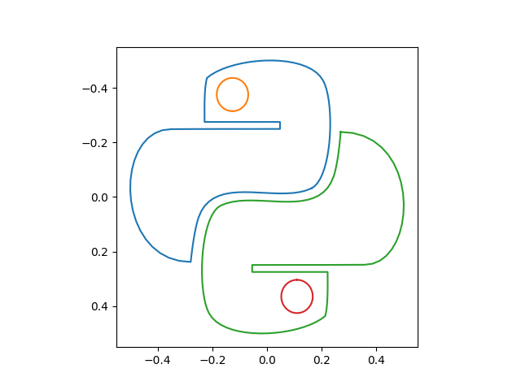

## Pure python: SVG path to 2D point parser

Pure functional implimentation.  
Should be easy to follow the implementation and extend.  

Functionality:  
- Parse SVG file to Python List representing SVG paths
- Generate list of 2D points from SVG paths
- Convert SVG relative paths to absolute representation

pip install from repo
```
pip install git+https://github.com/RaubCamaioni/svgpath.git
```

## Parse SVG paths
```python
import svgpath

python_logo = """<?xml version="1.0" encoding="iso-8859-1"?>
<svg>		
  <path d="M11.298,8.02c1.295-0.587,1.488-5.055,0.724-6.371c-0.998-1.718-5.742-1.373-7.24-0.145
    C4.61,2.114,4.628,3.221,4.636,4.101h4.702v0.412H4.637c0,0.006-2.093,0.013-2.093,0.013c-3.609,0-3.534,7.838,1.228,7.838
    c0,0,0.175-1.736,0.481-2.606C5.198,7.073,9.168,8.986,11.298,8.02z M6.375,3.465c-0.542,0-0.981-0.439-0.981-0.982
    c0-0.542,0.439-0.982,0.981-0.982c0.543,0,0.982,0.44,0.982,0.982C7.358,3.025,6.918,3.465,6.375,3.465z"/>
  <path d="M13.12,4.691c0,0-0.125,1.737-0.431,2.606c-0.945,2.684-4.914,0.772-7.045,1.738
    C4.35,9.622,4.155,14.09,4.92,15.406c0.997,1.719,5.741,1.374,7.24,0.145c0.172-0.609,0.154-1.716,0.146-2.596H7.603v-0.412h4.701
    c0-0.006,2.317-0.013,2.317-0.013C17.947,12.53,18.245,4.691,13.12,4.691z M10.398,13.42c0.542,0,0.982,0.439,0.982,0.982
    c0,0.542-0.44,0.981-0.982,0.981s-0.981-0.439-0.981-0.981C9.417,13.859,9.856,13.42,10.398,13.42z"/>
</svg>"""

tree = svgpath.parse(python_logo)
for path, start, end in tree:
    print(f"Path: {start}-{end}")
    for token in path:
        print("\t", token)
```
```
Path: 72-500
         ['M', '11.298', '8.02']
         ['c', '1.295', '-0.587', '1.488', '-5.055', '0.724', '-6.371']
         ['c', '-0.998', '-1.718', '-5.742', '-1.373', '-7.24', '-0.145']
         ['C', '4.61', '2.114', '4.628', '3.221', '4.636', '4.101']
         ['h', '4.702']
         ['v', '0.412']
         ['H', '4.637']
         ['c', '0', '0.006', '-2.093', '0.013', '-2.093', '0.013']
         ['c', '-3.609', '0', '-3.534', '7.838', '1.228', '7.838']
         ['c', '0', '0', '0.175', '-1.736', '0.481', '-2.606']
         ['C', '5.198', '7.073', '9.168', '8.986', '11.298', '8.02']
         ['z']
         ['M', '6.375', '3.465']
         ['c', '-0.542', '0', '-0.981', '-0.439', '-0.981', '-0.982']
         ['c', '0', '-0.542', '0.439', '-0.982', '0.981', '-0.982']
         ['c', '0.543', '0', '0.982', '0.44', '0.982', '0.982']
         ['C', '7.358', '3.025', '6.918', '3.465', '6.375', '3.465']
         ['z']
Path: 515-944
         ['M', '13.12', '4.691']
         ['c', '0', '0', '-0.125', '1.737', '-0.431', '2.606']
         ['c', '-0.945', '2.684', '-4.914', '0.772', '-7.045', '1.738']
         ['C', '4.35', '9.622', '4.155', '14.09', '4.92', '15.406']
         ['c', '0.997', '1.719', '5.741', '1.374', '7.24', '0.145']
         ['c', '0.172', '-0.609', '0.154', '-1.716', '0.146', '-2.596']
         ['H', '7.603']
         ['v', '-0.412']
         ['h', '4.701']
         ['c', '0', '-0.006', '2.317', '-0.013', '2.317', '-0.013']
         ['C', '17.947', '12.53', '18.245', '4.691', '13.12', '4.691']
         ['z']
         ['M', '10.398', '13.42']
         ['c', '0.542', '0', '0.982', '0.439', '0.982', '0.982']
         ['c', '0', '0.542', '-0.44', '0.981', '-0.982', '0.981']
         ['s', '-0.981', '-0.439', '-0.981', '-0.981']
         ['C', '9.417', '13.859', '9.856', '13.42', '10.398', '13.42']
         ['z']
```
## Convert to SVG Absolute

Breaking relative dependence between SVG tokens.  
Allows for the partial display of an SVG path.  

```python
from svgpath import (
    tree_to_paths,
    absolute_paths,
)

# expand generator of generators (needed to compare generator outputs)
paths = [[token for token in path] for path in tree_to_paths(tree)]
apaths = [[token for token in path] for path in absolute_paths(paths)]

for i, (path, apath) in enumerate(zip(paths, apaths)):
    print(f"Path: {i}")
    for token, atoken in zip(path, apath):
        print(f"  {token} {atoken}")
```
```
Path: 0
  ['M', '11.298', '8.02'] ['M', '11.298', '8.02']
  ['c', '1.295', '-0.587', '1.488', '-5.055', '0.724', '-6.371'] ['C', '12.593', '7.433', '12.786', '2.965', '12.022', '1.649']
  ['c', '-0.998', '-1.718', '-5.742', '-1.373', '-7.24', '-0.145'] ['C', '11.024', '-0.069', '6.28', '0.276', '4.782', '1.504']
  ['C', '4.61', '2.114', '4.628', '3.221', '4.636', '4.101'] ['C', '4.61', '2.114', '4.628', '3.221', '4.636', '4.101']
  ['h', '4.702'] ['H', '9.338']
  ['v', '0.412'] ['V', '4.513']
  ['H', '4.637'] ['H', '4.637']
  ['c', '0', '0.006', '-2.093', '0.013', '-2.093', '0.013'] ['C', '4.637', '4.519', '2.544', '4.526', '2.544', '4.526']
  ['c', '-3.609', '0', '-3.534', '7.838', '1.228', '7.838'] ['C', '-1.065', '4.526', '-0.99', '12.364', '3.772', '12.364']
  ['c', '0', '0', '0.175', '-1.736', '0.481', '-2.606'] ['C', '3.772', '12.364', '3.947', '10.628', '4.253', '9.758']
  ['C', '5.198', '7.073', '9.168', '8.986', '11.298', '8.02'] ['C', '5.198', '7.073', '9.168', '8.986', '11.298', '8.02']
  ['z'] ['Z']
  ['M', '6.375', '3.465'] ['M', '6.375', '3.465']
  ['c', '-0.542', '0', '-0.981', '-0.439', '-0.981', '-0.982'] ['C', '5.833', '3.465', '5.394', '3.026', '5.394', '2.483']
  ['c', '0', '-0.542', '0.439', '-0.982', '0.981', '-0.982'] ['C', '5.394', '1.941', '5.833', '1.501', '6.375', '1.501']
  ['c', '0.543', '0', '0.982', '0.44', '0.982', '0.982'] ['C', '6.918', '1.501', '7.357', '1.941', '7.357', '2.483']
  ['C', '7.358', '3.025', '6.918', '3.465', '6.375', '3.465'] ['C', '7.358', '3.025', '6.918', '3.465', '6.375', '3.465']
  ['z'] ['Z']
Path: 1
  ['M', '13.12', '4.691'] ['M', '13.12', '4.691']
  ['c', '0', '0', '-0.125', '1.737', '-0.431', '2.606'] ['C', '13.12', '4.691', '12.995', '6.428', '12.689', '7.297']
  ['c', '-0.945', '2.684', '-4.914', '0.772', '-7.045', '1.738'] ['C', '11.744', '9.981', '7.775', '8.069', '5.644', '9.035']
  ['C', '4.35', '9.622', '4.155', '14.09', '4.92', '15.406'] ['C', '4.35', '9.622', '4.155', '14.09', '4.92', '15.406']
  ['c', '0.997', '1.719', '5.741', '1.374', '7.24', '0.145'] ['C', '5.917', '17.125', '10.661', '16.78', '12.16', '15.551']
  ['c', '0.172', '-0.609', '0.154', '-1.716', '0.146', '-2.596'] ['C', '12.332', '14.942', '12.314', '13.835', '12.306', '12.955']
  ['H', '7.603'] ['H', '7.603']
  ['v', '-0.412'] ['V', '12.543']
  ['h', '4.701'] ['H', '12.304']
  ['c', '0', '-0.006', '2.317', '-0.013', '2.317', '-0.013'] ['C', '12.304', '12.537', '14.621', '12.53', '14.621', '12.53']
  ['C', '17.947', '12.53', '18.245', '4.691', '13.12', '4.691'] ['C', '17.947', '12.53', '18.245', '4.691', '13.12', '4.691']
  ['z'] ['Z']
  ['M', '10.398', '13.42'] ['M', '10.398', '13.42']
  ['c', '0.542', '0', '0.982', '0.439', '0.982', '0.982'] ['C', '10.94', '13.42', '11.38', '13.859', '11.38', '14.402']
  ['c', '0', '0.542', '-0.44', '0.981', '-0.982', '0.981'] ['C', '11.38', '14.944', '10.94', '15.383', '10.398', '15.383']
  ['s', '-0.981', '-0.439', '-0.981', '-0.981'] ['S', '9.417', '14.944', '9.417', '14.402']
  ['C', '9.417', '13.859', '9.856', '13.42', '10.398', '13.42'] ['C', '9.417', '13.859', '9.856', '13.42', '10.398', '13.42']
  ['z'] ['Z']
```
## Plot SVG Paths
```python
# python script
from matplotlib import pyplot as plt
from svgpath import paths_to_points
paths = list(tree_to_paths(tree))

_, ax = plt.subplots()
ax.invert_yaxis() # origin at top left
for path in paths_to_points(paths, resolution=100):
    for trace in path:
        ax.plot(trace[:, 0], trace[:, 1])
plt.show()
```
The library includes a plotting script.  
It requires matplotlib and pyqt6 be installed "pip install svgpath[display]".  
```bash
svg-plot -i python_logo.svg
```


